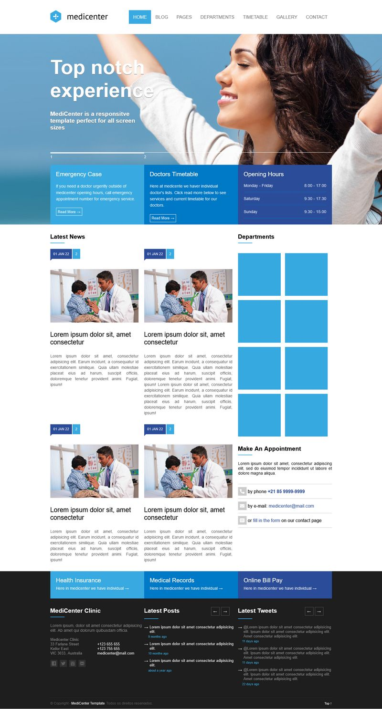

<h1 align="center"> MediCenter </h1>

Template desenvolvido no curso B7WEB Fullstack apenas para testar conceitos de flexbox  

  <a href="#-tecnologias">Tecnologias</a>&nbsp;&nbsp;&nbsp;|&nbsp;&nbsp;&nbsp;
  <a href="#-projeto">Projeto</a>&nbsp;&nbsp;&nbsp;|&nbsp;&nbsp;&nbsp;

 

  

## 🚀 Tecnologias

Esse projeto foi desenvolvido com as seguintes tecnologias:

- HTML e CSS
- JavaScript
- Git e Github

## 💻 Projeto

O projeto apresenta um template responsivo para ser utilizado em sites relacionados a medicina.

- [Acesse o projeto finalizado, online](https://albertmagnus011.github.io/medicenter/)

---

Feito com ♥ by Marcos da Silva